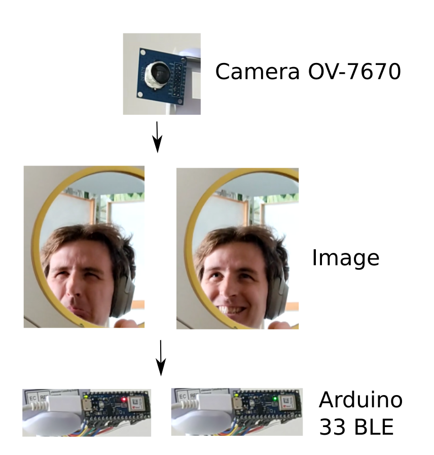

# Emotion detection with Arduino and a cheap camera

## Summary

ML model runs on a microcontroller and detects emotions from camera images.

A cheap camera provides images to the ML model running on arduino microcontroller.
The tiny ML model differentiates between 3 facial expressions (frowning, happy, neutral) and runs infrerence at a rate of about 1Hz. The model contains less than 1500 parameters and achieves a test accuracy of 70%. The accuracy in deployment is acceptable - as seen in [this video demonstration](./demo.mp4).

 A lot of inspiration has been drown from [this GSoC post](https://www.hackster.io/theevildoof/tutorial-tinyml-with-ov7670-camera-module-302e35) and [the Tiny ML free online course](https://github.com/tinyMLx/arduino-library).

## Requirements
- Arduino 33 BLE ("sense" not required) and OV7670 camera
- Get the training dataset. I trained the model using [this kaggle dataset](https://www.kaggle.com/datasets/jonathanoheix/face-expression-recognition-dataset) keeping `neutral` and `happy` data as is and combining `angry` + `disgust` into a single class named `frown`
- OpenCV >= 4.7, pyserial, Tensorflow >= 2.12, can installed within anaconda environment - [see link](https://www.tensorflow.org/install/pip)
- Arduino-IDE. You have to manually download (and compile) the TF lite micro library as it is no longer displayed in the library manager at the time of writing. See the [official repo for instructions](https://github.com/tensorflow/tflite-micro-arduino-examples#github)

## Steps to reproduce
- Get dataset and train the model as per `model.ipynb`
- Try out the trained model and export it to TF Lite micro as per `inference.ipynb`
    - This is where you can feed the images of your choice (e.g. your own face) to the model
    - Not all operations are supported by TF Lite micro
- Connect camera to arduino
    - To check camera works fine upload `processing_ov7670_live_image` to the microcontroller  using Arduino IDE (based on [this GSoC post](https://www.hackster.io/theevildoof/tutorial-tinyml-with-ov7670-camera-module-302e35)). Once uploaded can launch `processing.py` to check the feed from camera on pc.
- Run the inference using the arduino + camera
    - Copy the bytes of TF Lite micro model (exported by `inference.ipynb`) into `emotion_detect_model_data.cpp` of `emotion_detection_ino` project (based on an example from [the Tiny ML free online course](https://github.com/tinyMLx/arduino-library))
    - Upload `emotion_detection_ino` project to arduino. Again you can launch `processing.py` on pc to see the camera image and associated classification scores.
- Debugging
    - You can store a known image on arduino and compare the output you get from TF Lite micro model with what you get when classifying the same image on pc with 'full' TF
